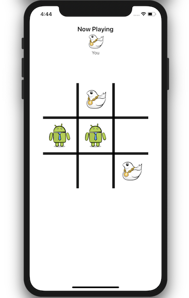

# AppTacToe-BDT

## Overview
This project is part of my implemetnation of behaviour driven testing using ```Quick``` and ```Nimble```.
For this purpose i am using TicTacToe app and writing BDT on its gameplay. 



## Behavior-Driven Testing
In behavior-driven testing (or BDT), your tests are based on user stories that describe some specific expected behavior of your application. Instead of testing implementation details, you’re actually testing what matters: does your app deliver your user stories correctly?

This approach makes tests extremely readable and maintainable, and helps describe the behavior of logical portions in your application to other developers who might be lucky enough to go through your beautiful code one day.

## Quick And Nimble
Quick itself provides most of the basic syntax and abilities related to writing tests in a behavior-driven way, while Nimble is its companion framework. It provides additional expressive matching and assertion abilities via Matchers, which you’ll learn about a bit later in this tutorial.
